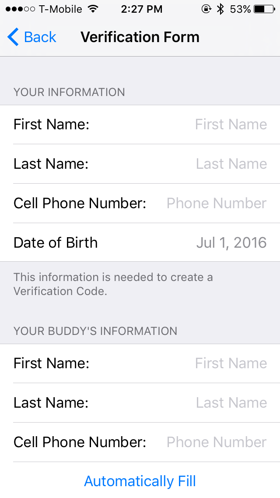

# RentABuddy

RentABuddy was my first fully-working iOS app; I worked on it from early- to mid-2016.

All of the source code is under the [RentABuddy](https://github.com/LF-luis/RentABuddy/tree/master/RentABuddy) directory.

## Build
- Xcode 7
- Swift 2
- Cocoapods and dependencies copies are included in repo

## Purpose of RentABuddy
The idea of the app was to be able to find home-services (e.g. handyman work) through the app, and to use friend's recommendations to have a trustworhy pool of workers.

## Screenshots
Some screenshots of the app:
<table>
  <tr>
    <th> Home View</th>
    <th> Log In View</th>
    <th> Verification View</th>
  </tr>
  <tr>
    <th>
      
    </th>
    <th>
      
    </th>
    <th>
      
    </th>
  </tr>
  <tr>
    <th>Registration View</th>
    <th>Adding a "Buddy"</th>
  </tr>
  <tr>
    <th>
      
    </th>
    <th>
      
    </th>
  </tr>
</table>

 
 
 

The application was built alongside a Microsoft Azure backend application which will not be open-sourced.
 
Note: This is a project I stopped working on about 4 years ago, thus it does not reflect my current level of experience as an iOS developer.
